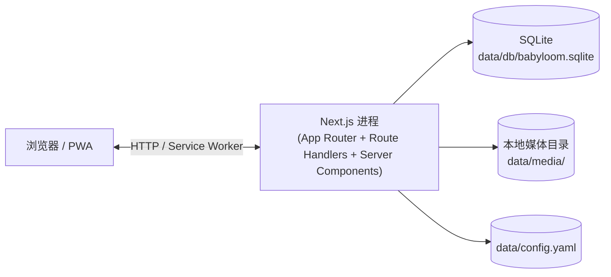
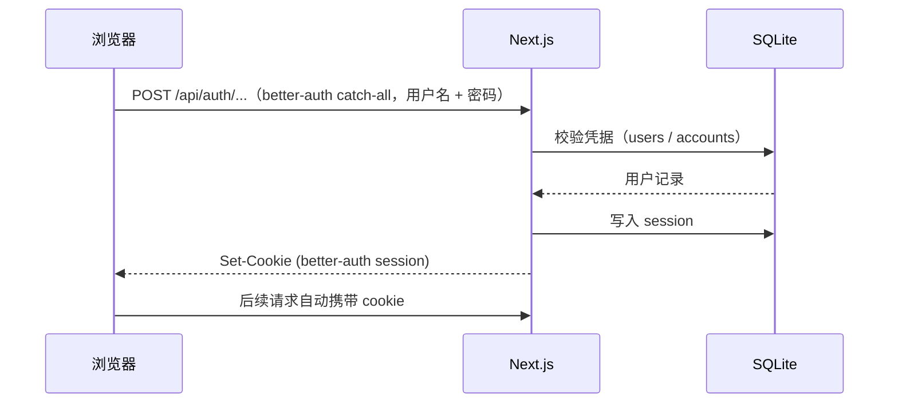
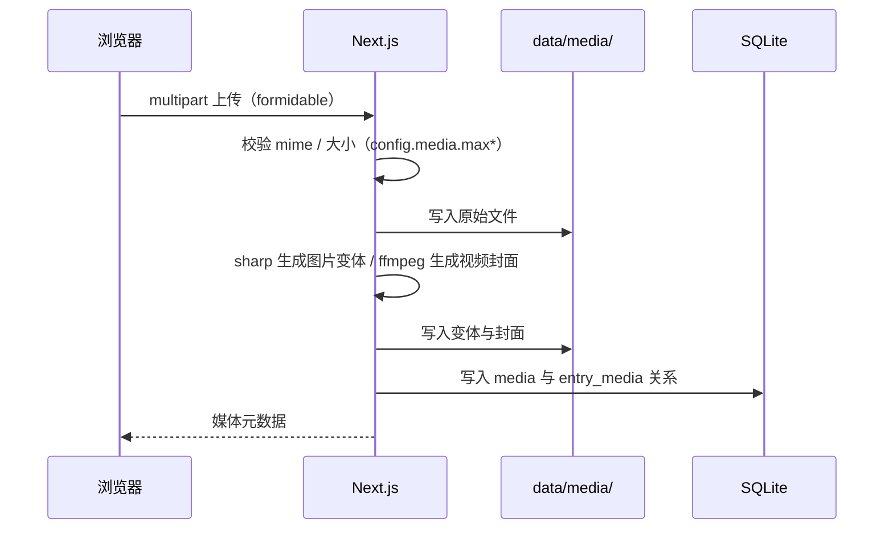

# 架构

Babyloom 是一个 Next.js 单体应用：页面、API、PWA、Service Worker 都在同一个 Next.js 进程里。数据落在本地 SQLite，媒体文件落在本地数据目录。没有独立后端服务，也没有 PostgreSQL 或外部消息队列。

## 运行时拓扑



生产部署时前面通常再加一层反向代理（Nginx / Caddy）承担 HTTPS 终止，见 [deployment.md](./deployment.md)。

## 模块边界

```text
app/                       Next.js 页面 + Route Handlers + service worker 入口
components/                UI、移动端壳、业务组件
lib/
├── client/                浏览器侧工具（hooks、错误上报、在线检测）
└── server/                服务端模块
    ├── auth/              better-auth 适配（cookie session）
    ├── avatar/            头像处理
    ├── backup/            备份导出
    ├── bootstrap/         启动初始化（config → db → owner 注入）
    ├── config/            config.yaml 解析与校验
    ├── db/                Drizzle client + schema + migrations
    ├── log/               文件日志
    ├── media/             图片变体、视频封面、媒体元数据
    ├── members/           家庭成员管理
    ├── permissions/       per-baby 权限判定
    └── trash/             软删除与垃圾桶
styles/                    设计 token、字体
public/                    字体、PWA manifest 与图标
tests/                     Vitest + Playwright
```

UI 设计 token 与字体策略见 [design-system.md](./design-system.md)。表结构见 [database.md](./database.md)。路由清单见 [api.md](./api.md)。

## 启动初始化

启动相关逻辑分布在 `lib/server/bootstrap/`（owner 注入）与 `lib/server/db/migrate.ts`（迁移），大致顺序为：

1. 读取 `data/config.yaml`，按 schema 校验（`lib/server/config/`）
2. 打开 SQLite 数据库（路径来自 `BABYLOOM_DATA_DIR` 或默认 `data/`）
3. 应用待执行的 Drizzle 迁移
4. 根据 `config.yaml` 注入或更新 owner 账号（owner 密码以配置文件为准）

修改 `data/config.yaml` 后**重启进程**即可生效。配置字段语义见 [configuration.md](./configuration.md)。

## 关键流程

### 登录 / 会话



认证模型详见 [api.md](./api.md#认证模型)。

### 媒体上传



写操作要求在线（PWA 离线时被阻止），逻辑在 `lib/client/require-online`。

### 备份导出

owner 在 `/profile/data` 触发后，`lib/server/backup` 将 SQLite 快照（`snapshot.db`）与 `media/` 目录打包成 zip 流返回浏览器。恢复流程是手动的，详见 [deployment.md](./deployment.md#恢复)。

### 软删除 → 垃圾桶 → 清空

宝宝、记录、媒体的删除都是软删除：标记删除时间但保留记录。垃圾桶视图列出软删除项，支持恢复或清空。清空时才物理删除媒体文件与数据库行。字段定义见 [database.md](./database.md)。

## 离线策略

Serwist 生成的 service worker（构建输出到 `public/sw.js`）提供：

- 静态资源缓存与离线 fallback 页（只读体验）
- 写类请求（新增、编辑、上传、删除、备份导出）在离线时被 `lib/client/require-online` 阻止并提示

不存在写操作的离线队列；要写就必须在线。
