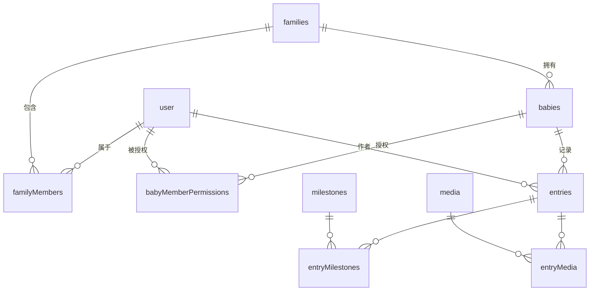

# 数据库

Babyloom 使用 SQLite + [Drizzle ORM](https://orm.drizzle.team/)。schema 定义和迁移文件是事实来源，本文档只描述概念关系与运维流程。

- **Schema 源**：[`lib/server/db/schema.ts`](../lib/server/db/schema.ts)
- **迁移目录**：[`lib/server/db/migrations/`](../lib/server/db/migrations/)
- **数据库文件**：`data/db/babyloom.sqlite`（数据目录可由 `BABYLOOM_DATA_DIR` 改写，见 [configuration.md](./configuration.md)）

## 表清单

| 表 | 用途 |
|---|---|
| `user` | 所有账户（owner 与 member），better-auth 主体表 |
| `session` | better-auth 会话 |
| `account` | better-auth 凭据 |
| `verification` | better-auth 校验码（如有用到） |
| `families` | 家庭（单实例部署通常只有一条） |
| `familyMembers` | user ↔ family 成员关系 |
| `babies` | 宝宝 |
| `babyMemberPermissions` | per-baby 的成员权限位（查看 / 编辑 / 管理） |
| `entries` | 文字记录 |
| `milestones` | 里程碑定义 |
| `entryMilestones` | entry ↔ milestone 关联 |
| `media` | 媒体（图片 / 视频） + 变体与封面记录 |
| `entryMedia` | entry ↔ media 关联 |

字段类型、约束、索引以 schema 文件为准。

## 实体关系



## 权限字段语义

`babyMemberPermissions` 表存储 user × baby 的权限位（典型字段：是否可查看、是否可编辑、是否可管理）。owner 不在此表中（owner 默认对所有 baby 拥有最高权限）。权限位与实际操作的对应矩阵见 [api.md](./api.md#权限矩阵)。

## 软删除约定

支持软删除的表（babies / entries / media）使用 `deletedAt` 时间戳字段。

- `deletedAt IS NULL`：正常可见
- `deletedAt IS NOT NULL`：在垃圾桶中
- 清空垃圾桶时物理删除行（媒体表对应的文件也由 `lib/server/trash` 一并清理）

## 时间戳约定

业务表（babies / entries / media 等）的 `createdAt` / `updatedAt` 是毫秒精度的 INTEGER（`Date.now()`）。时区由 `app.timezone` 控制展示，存储统一为 UTC。

> 注意：better-auth 自带的 `user` / `session` / `account` 表使用 Drizzle 的 `mode: 'timestamp'`，按**秒**存储，与业务表的毫秒不同。

## 迁移工作流

修改 `lib/server/db/schema.ts` 之后：

```bash
pnpm db:generate    # 由 schema diff 生成新的 SQL 迁移文件
pnpm db:migrate     # 应用迁移到当前数据库
```

应用启动时也会自动应用待执行的迁移（见 [architecture.md](./architecture.md#启动初始化)），所以生产环境不需要手动执行 `db:migrate`。

提交时同时提交 `lib/server/db/schema.ts` 和新生成的 migration SQL。

## 配置文件 vs 数据库

owner 的用户名 / 密码 / 昵称由 `data/config.yaml` 持有，应用启动时把它"打入"数据库的 `user` 表。要修改 owner 凭据，**改 yaml 后重启**，不要直接改数据库。家庭名称 (`family.name`) 同理。其它实体（成员、宝宝、记录等）都是普通业务数据，只在数据库中维护。
