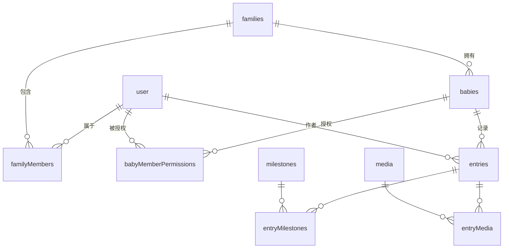

# 数据库

Babyloom 使用 SQLite + [Drizzle ORM](https://orm.drizzle.team/)。schema 定义和迁移文件是事实来源，本文档只描述概念关系与运维流程。

- **Schema 源**：[`lib/server/db/schema.ts`](../lib/server/db/schema.ts)
- **迁移目录**：[`lib/server/db/migrations/`](../lib/server/db/migrations/)
- **数据库文件**：`data/db/babyloom.sqlite`（数据目录可由 `BABYLOOM_DATA_DIR` 改写，见 [configuration.md](./configuration.md)）

## 表清单

| 表 | 用途 |
|---|---|
| `user` | 所有账户（owner 与 member），better-auth 主体表 |
| `session` | better-auth 会话 |
| `account` | better-auth 凭据 |
| `verification` | better-auth 校验码（如有用到） |
| `families` | 家庭（单实例部署通常只有一条） |
| `familyMembers` | user ↔ family 成员关系 |
| `babies` | 宝宝 |
| `babyMemberPermissions` | per-baby 的成员权限位（查看 / 编辑 / 管理） |
| `entries` | 文字记录 |
| `milestones` | 里程碑定义 |
| `entryMilestones` | entry ↔ milestone 关联 |
| `media` | 媒体（图片 / 视频） + 变体与封面记录 |
| `entryMedia` | entry ↔ media 关联 |
| `app_settings` | 单行运行时设置（owner 可在 UI 修改、无需重启）；目前承载媒体清理的开关 / 阈值 / 运行统计 |

字段类型、约束、索引以 schema 文件为准。

## 实体关系

## 权限字段语义

`babyMemberPermissions` 表存储 user × baby 的权限位（典型字段：是否可查看、是否可编辑、是否可管理）。owner 不在此表中（owner 默认对所有 baby 拥有最高权限）。权限位与实际操作的对应矩阵见 [api.md](./api.md#权限矩阵)。

## 账户默认头像颜色

`user.avatar_color` 保存账户未上传头像时使用的颜色键。创建成员时，系统优先从该家庭尚未使用的 8 个头像色中随机分配，因此前 8 个家庭账户不会撞色；颜色全部占用后才允许复用。颜色一经写入不会因刷新、重启或修改昵称而改变。

升级旧数据时，迁移先增加可空字段，随后启动引导在家庭关系建立后为缺少合法颜色的 owner/member 补齐并持久化。上传头像只改变 `user.image`；删除上传头像后仍使用原有 `avatar_color`。

## 软删除约定

支持软删除的表（babies / entries / media）使用 `deletedAt` 时间戳字段。

- `deletedAt IS NULL`：正常可见
- `deletedAt IS NOT NULL`：在垃圾桶中
- 清空垃圾桶时物理删除行（媒体表对应的文件也由 `lib/server/trash` 一并清理）
- 记录（entry）软删除会**级联**其附带的媒体：仅当某媒体不再挂在任何 `active` 记录上时才一并进垃圾桶，恢复记录时一并恢复（见 `lib/server/trash/entry-media-cascade.ts`）。批量补传的独立媒体（无 entry 关联）不受影响。
- 媒体的 `origin` 字段区分来源：`'standalone'`（默认，永久画廊照片——批量补传的历史照片，或已存入某条记录的 composer 上传）与 `'entry_draft'`（composer 上传但**尚未存入任何记录**）。成功 attach 进记录、或从垃圾桶手动恢复时都会把 `entry_draft` 提升为 `standalone`（见 `app/api/entries/[id]/media/[mediaId]/attach`、`app/api/media/[id]/restore`），因此事后 detach（设计上保留在画廊）或恢复一张被兜底清理的孤儿都不会被再次误判为孤儿。后台 reconcile worker（`lib/server/media/reconcile.ts`）只把创建超过阈值、仍 `status='ready'` 且未挂任何 entry 的 `entry_draft` 媒体软删除，兜底用户中途弃稿/断网/部分 attach 失败遗留的孤儿；`standalone` 永不被自动清理。该清理的开关与阈值由 owner 在运行时设置（`app_settings`，见下文「运行时设置」）控制，默认开启、阈值 24h（与历史硬编码行为一致）。兜底按上传时间(`createdAt`)判定，无法感知「草稿仍开着」；若一张草稿存活超过阈值被误删，用户真正提交时 attach 会把这张**系统软删(`deletedBy IS NULL`)、同一上传者**的 `entry_draft` 媒体原地恢复(`ready` + 关联 + 提升 `standalone`)，避免「entry 已存、图却进了垃圾桶」。用户主动删除的媒体(`deletedBy` 非空)不会被这样复活。

## 时间戳约定

业务表（babies / entries / media 等）的 `createdAt` / `updatedAt` 是毫秒精度的 INTEGER（`Date.now()`）。时区由 `app.timezone` 控制展示，存储统一为 UTC。

> 注意：better-auth 自带的 `user` / `session` / `account` 表使用 Drizzle 的 `mode: 'timestamp'`，按**秒**存储，与业务表的毫秒不同。

## 迁移工作流

> ⚠️ 注意：`drizzle.config.ts` 与 `package.json` 的 `db:generate` / `db:migrate` 脚本仍指向**已失效的旧路径** `lib/db/`（`schema: './lib/db/schema.ts'`、`tsx lib/db/migrate.ts`），而真实文件早已搬到 `lib/server/db/`。因此这两个 CLI 命令**当前无法直接使用**。在修好这些配置之前，迁移按下面的方式**手写**。

修改 `lib/server/db/schema.ts` 之后：

1. 在 `lib/server/db/migrations/` 手写新的 SQL 迁移文件（编号接续上一条，如 `0005_xxx.sql`），并在 `lib/server/db/migrations/meta/_journal.json` 追加对应条目——照搬最近一条迁移的写法即可。
2. 无需手动执行迁移：应用启动时会通过 `lib/server/db/migrate.ts` 自动应用所有待执行的迁移（见 [architecture.md](./architecture.md#启动初始化)），开发与生产都如此。

提交时同时提交 `lib/server/db/schema.ts`、新增的 migration SQL 与 `_journal.json` 改动。

## 配置文件 vs 数据库

owner 的用户名 / 密码 / 昵称由 `data/config.yaml` 持有，应用启动时把它"打入"数据库的 `user` 表。要修改 owner 凭据，**改 yaml 后重启**，不要直接改数据库。家庭名称 (`family.name`) 同理。其它实体（成员、宝宝、记录等）都是普通业务数据，只在数据库中维护。

## 运行时设置（app_settings）

`app_settings` 是本项目第一张**运行时、UI 可改**的配置表：用固定主键的单行存储，owner 在 `/profile/cleanup` 修改后**立即生效、无需重启**（与需要改文件+重启的 `config.yaml` 互补）。读写集中在 `lib/server/settings/cleanup.ts`：读取在行缺失时回退到安全默认（开启 / 24h），写入走单条**列隔离** upsert（`INSERT ... ON CONFLICT(id) DO UPDATE SET <仅本写入方的列>`），因为同一行有两个独立写入方——owner 配置（开关 / 阈值）与 worker 运行统计（上次运行时间 / 删除数）——且升级安装时该行尚不存在，任一方都可能是首个写入方，列隔离避免互相覆盖。阈值在写入时校验范围（6–720h）。字段以 schema 为准。
