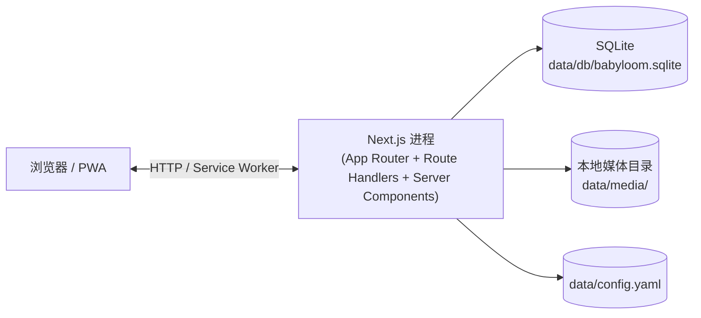
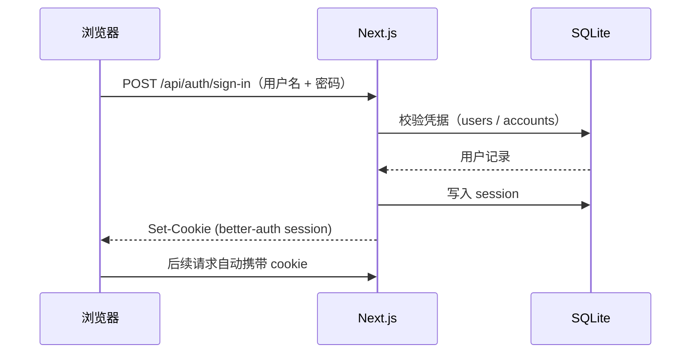
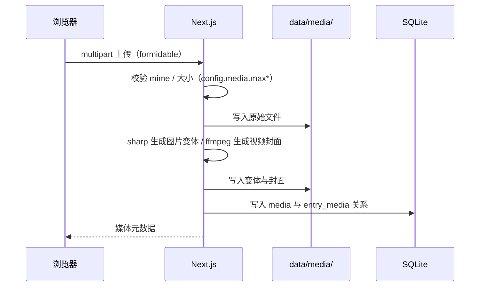
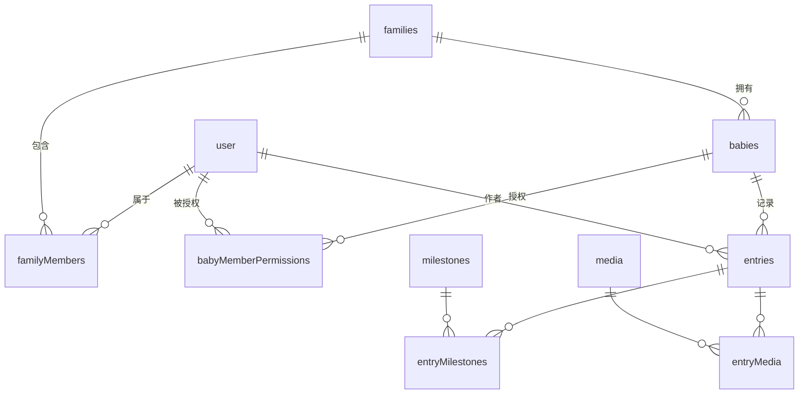

# 文档体系重构实施计划

> **For agentic workers:** REQUIRED SUB-SKILL: Use superpowers:subagent-driven-development (recommended) or superpowers:executing-plans to implement this plan task-by-task. Steps use checkbox (`- [ ]`) syntax for tracking.

**Goal:** 把过时的 `docs/` 重构成与当前实现一致的 7 文件体系，并轻度优化根 `README.md`；旧文档直接删除，依赖 git 历史保留。

**Architecture:** 单一信息源（SSoT）：每个主题钉死到唯一权威文档，其它地方只能链接，禁止复述。落地次序按"被引用先写、引用方后写"，避免链断。

**Tech Stack:** Markdown only（GitHub-flavored，Mermaid 用于图）。无代码改动。

**Spec:** [`docs/superpowers/specs/2026-05-28-docs-restructure-design.md`](../specs/2026-05-28-docs-restructure-design.md)

---

## 文件结构

最终交付的 `docs/` 结构：

```
docs/
├── README.md             # 文档入口 + 阅读路径
├── architecture.md       # 系统架构 + 模块边界 + 关键流程
├── deployment.md         # Docker / NAS / 反代 / 升级 / 备份恢复
├── configuration.md      # config.yaml + 环境变量 + 安全建议
├── database.md           # Drizzle 表清单 + ER 图 + 迁移流程
├── api.md                # 认证模型 + 权限矩阵 + 路由分区索引
└── design-system.md      # 设计 token + 字体 + 用法示例
```

被删除的文件（git rm）：`docs/{api,database,deployment,features,README}.md`
被改名的文件：`docs/DESIGN.md` → `docs/design-system.md`（内容保留 + 补用法示例）

---

## 验证脚本（每次写完文档自查）

每个文档写完后，运行下面这段确保未引入过时术语：

```bash
! grep -nE "NestJS|PostgreSQL|JWT" docs/<file>.md
```

期望：无输出（grep 在无匹配时返回非零退出，加 `!` 反转）。如果命中且非链接/历史说明上下文，需修复。

---

## Task 1: 删除旧文档

**Files:**
- Delete: `docs/README.md`
- Delete: `docs/api.md`
- Delete: `docs/database.md`
- Delete: `docs/deployment.md`
- Delete: `docs/features.md`
- Keep: `docs/DESIGN.md`（下一任务改名）

- [ ] **Step 1: 删除 5 个旧 markdown**

```bash
git rm docs/README.md docs/api.md docs/database.md docs/deployment.md docs/features.md
```

- [ ] **Step 2: 验证 docs/ 只剩 DESIGN.md 与 superpowers 目录**

```bash
ls docs/
```

期望输出：`DESIGN.md  superpowers`

- [ ] **Step 3: Commit**

```bash
git commit -m "docs: remove stale docs describing obsolete 3-tier architecture

These docs described an unimplemented NestJS + PostgreSQL design that
never reflected the current Next.js + SQLite monolith. Removed in favor
of a focused rewrite tracked in docs/superpowers/specs/2026-05-28-docs-restructure-design.md.
Historical versions remain accessible via git history."
```

---

## Task 2: 改名 DESIGN.md → design-system.md 并补用法示例

**Files:**
- Rename: `docs/DESIGN.md` → `docs/design-system.md`
- Modify: `docs/design-system.md`（追加用法示例小节）

- [ ] **Step 1: git mv 改名**

```bash
git mv docs/DESIGN.md docs/design-system.md
```

- [ ] **Step 2: 在文件末尾追加"用法示例"小节**

在 `docs/design-system.md` 末尾追加：

````markdown

## 用法示例

### 颜色：必须用 token，不能写 hex

```css
/* ✅ */
.card {
  background: var(--color-surface);
  color: var(--color-fg);
}

/* ❌ ESLint 规则 babyloom/no-raw-color 会拦截 */
.card {
  background: #ffffff;
  color: rgb(24, 24, 24);
}
```

需要新颜色时，先在 `styles/tokens.css` 中加入 token，再在组件里引用。

### 字号：用 `--text-*` 阶梯而不是字面值

```css
/* ✅ */
.heading {
  font-size: var(--text-xl);
}

/* ❌ */
.heading {
  font-size: 24px;
}
```

### 间距：优先 `--space-*`

间距阶梯是 `--space-1` 到 `--space-12` 加 `--space-section`。短距用相邻阶梯组合，超出范围再考虑加 token。

### 圆角与阴影

按用途选择：`--radius-card` 给卡片、`--radius-pill` 给按钮、`--radius-xs/sm` 给小型控件。阴影 `--shadow-card` 用于平铺面板，`--shadow-press` 系列用于可按压控件。

### 图层（z-index）

不要写字面 `z-index`，用 `--z-tabbar` / `--z-sticky` / `--z-sheet` / `--z-modal` / `--z-toast`，保证视觉层级一致。
````

- [ ] **Step 3: 验证过时术语**

```bash
! grep -nE "NestJS|PostgreSQL|JWT" docs/design-system.md
```

期望：无输出。

- [ ] **Step 4: Commit**

```bash
git add docs/design-system.md
git commit -m "docs(design-system): rename from DESIGN.md and add usage examples"
```

---

## Task 3: 写 docs/architecture.md

**Files:**
- Create: `docs/architecture.md`

被其它文档引用，先写。

- [ ] **Step 1: 创建 docs/architecture.md，内容如下**

````markdown
# 架构

BabyLoom 是一个 Next.js 单体应用：页面、API、PWA、Service Worker 都在同一个 Next.js 进程里。数据落在本地 SQLite，媒体文件落在本地数据目录。没有独立后端服务，也没有 PostgreSQL 或外部消息队列。

## 运行时拓扑



生产部署时前面通常再加一层反向代理（Nginx / Caddy）承担 HTTPS 终止，见 [deployment.md](./deployment.md)。

## 模块边界

```text
app/                       Next.js 页面 + Route Handlers + service worker 入口
components/                UI、移动端壳、业务组件
lib/
├── client/                浏览器侧工具（hooks、错误上报、在线检测）
└── server/                服务端模块
    ├── auth/              better-auth 适配（cookie session）
    ├── avatar/            头像处理
    ├── backup/            备份导出
    ├── bootstrap/         启动初始化（config → db → owner 注入）
    ├── config/            config.yaml 解析与校验
    ├── db/                Drizzle client + schema + migrations
    ├── log/               文件日志
    ├── media/             图片变体、视频封面、媒体元数据
    ├── members/           家庭成员管理
    ├── permissions/       per-baby 权限判定
    └── trash/             软删除与垃圾桶
styles/                    设计 token、字体
public/                    字体、PWA manifest 与图标
tests/                     Vitest + Playwright
```

UI 设计 token 与字体策略见 [design-system.md](./design-system.md)。表结构见 [database.md](./database.md)。路由清单见 [api.md](./api.md)。

## 启动初始化

应用启动时（`lib/server/bootstrap/`）按顺序执行：

1. 读取 `data/config.yaml`，按 schema 校验
2. 打开 SQLite 数据库（路径来自 `BABYLOOM_DATA_DIR` 或默认 `data/`）
3. 应用待执行的 Drizzle 迁移
4. 根据 `config.yaml` 注入或更新 owner 账号（owner 密码以配置文件为准）

修改 `data/config.yaml` 后**重启进程**即可生效。配置字段语义见 [configuration.md](./configuration.md)。

## 关键流程

### 登录 / 会话



认证模型详见 [api.md](./api.md#认证模型)。

### 媒体上传



写操作要求在线（PWA 离线时被阻止），逻辑在 `lib/client/require-online`。

### 备份导出

owner 在 `/profile/data` 触发后，`lib/server/backup` 将 SQLite 快照（`snapshot.db`）与 `media/` 目录打包成 zip 流返回浏览器。恢复流程是手动的，详见 [deployment.md](./deployment.md#恢复)。

### 软删除 → 垃圾桶 → 清空

宝宝、记录、媒体的删除都是软删除：标记删除时间但保留记录。垃圾桶视图列出软删除项，支持恢复或清空。清空时才物理删除媒体文件与数据库行。字段定义见 [database.md](./database.md)。

## 离线策略

Serwist 生成的 service worker（构建输出到 `public/sw.js`）提供：

- 静态资源缓存与离线 fallback 页（只读体验）
- 写类请求（新增、编辑、上传、删除、备份导出）在离线时被 `lib/client/require-online` 阻止并提示

不存在写操作的离线队列；要写就必须在线。
````

- [ ] **Step 2: 验证过时术语**

```bash
grep -nE "NestJS|PostgreSQL|JWT" docs/architecture.md ; echo exit=$?
```

期望：grep 输出为空，`exit=1`。

- [ ] **Step 3: Commit**

```bash
git add docs/architecture.md
git commit -m "docs(architecture): describe Next.js monolith runtime topology and flows"
```

---

## Task 4: 写 docs/database.md

**Files:**
- Create: `docs/database.md`
- Reference: `lib/server/db/schema.ts`（事实来源，不复制字段）

- [ ] **Step 1: 创建 docs/database.md**

````markdown
# 数据库

BabyLoom 使用 SQLite + [Drizzle ORM](https://orm.drizzle.team/)。schema 定义和迁移文件是事实来源，本文档只描述概念关系与运维流程。

- **Schema 源**：[`lib/server/db/schema.ts`](../lib/server/db/schema.ts)
- **迁移目录**：[`lib/server/db/migrations/`](../lib/server/db/migrations/)
- **数据库文件**：`data/db/babyloom.sqlite`（数据目录可由 `BABYLOOM_DATA_DIR` 改写，见 [configuration.md](./configuration.md)）

## 表清单

| 表 | 用途 |
|---|---|
| `user` | 所有账户（owner 与 member），better-auth 主体表 |
| `session` | better-auth 会话 |
| `account` | better-auth 凭据 |
| `verification` | better-auth 校验码（如有用到） |
| `families` | 家庭（单实例部署通常只有一条） |
| `familyMembers` | user ↔ family 成员关系 |
| `babies` | 宝宝 |
| `babyMemberPermissions` | per-baby 的成员权限位（查看 / 编辑 / 管理） |
| `entries` | 文字记录 |
| `milestones` | 里程碑定义 |
| `entryMilestones` | entry ↔ milestone 关联 |
| `media` | 媒体（图片 / 视频） + 变体与封面记录 |
| `entryMedia` | entry ↔ media 关联 |

字段类型、约束、索引以 schema 文件为准。

## 实体关系



## 权限字段语义

`babyMemberPermissions` 表存储 user × baby 的权限位（典型字段：是否可查看、是否可编辑、是否可管理）。owner 不在此表中（owner 默认对所有 baby 拥有最高权限）。权限位与实际操作的对应矩阵见 [api.md](./api.md#权限矩阵)。

## 软删除约定

支持软删除的表（babies / entries / media）使用 `deletedAt` 时间戳字段。

- `deletedAt IS NULL`：正常可见
- `deletedAt IS NOT NULL`：在垃圾桶中
- 清空垃圾桶时物理删除行（媒体表对应的文件也由 `lib/server/trash` 一并清理）

## 时间戳约定

所有业务表都有 `createdAt` / `updatedAt`（毫秒精度的 INTEGER）。时区由 `app.timezone` 控制；存储统一使用 UTC 毫秒戳。

## 迁移工作流

修改 `lib/server/db/schema.ts` 之后：

```bash
pnpm db:generate    # 由 schema diff 生成新的 SQL 迁移文件
pnpm db:migrate     # 应用迁移到当前数据库
```

应用启动时也会自动应用待执行的迁移（见 [architecture.md](./architecture.md#启动初始化)），所以生产环境不需要手动执行 `db:migrate`。

提交时同时提交 `lib/server/db/schema.ts` 和新生成的 migration SQL。

## 配置文件 vs 数据库

owner 的用户名 / 密码 / 昵称由 `data/config.yaml` 持有，应用启动时把它"打入"数据库的 `user` 表。要修改 owner 凭据，**改 yaml 后重启**，不要直接改数据库。家庭名称 (`family.name`) 同理。其它实体（成员、宝宝、记录等）都是普通业务数据，只在数据库中维护。
````

- [ ] **Step 2: 验证过时术语**

```bash
grep -nE "NestJS|PostgreSQL|JWT" docs/database.md ; echo exit=$?
```

期望：grep 输出为空，`exit=1`。

- [ ] **Step 3: Commit**

```bash
git add docs/database.md
git commit -m "docs(database): describe Drizzle/SQLite schema, ER, soft-delete, migrations"
```

---

## Task 5: 写 docs/configuration.md

**Files:**
- Create: `docs/configuration.md`
- Reference: `config.yaml.example`、`lib/server/config/schema.ts`

- [ ] **Step 1: 创建 docs/configuration.md**

````markdown
# 配置

BabyLoom 在启动时读取 `data/config.yaml`。本文档描述每个字段的语义、默认值和修改影响。

- **示例**：[`config.yaml.example`](../config.yaml.example)
- **校验源**：[`lib/server/config/schema.ts`](../lib/server/config/schema.ts)

## 文件位置

默认从 `<数据目录>/config.yaml` 读取。数据目录由环境变量 `BABYLOOM_DATA_DIR` 决定，未设置时为项目根的 `data/`。

容器部署中，`docker-compose.yml` 把宿主机 `./data` 挂载到 `/app/data`（见 [deployment.md](./deployment.md)）。

建议：

```bash
chmod 600 data/config.yaml
```

避免同主机其它用户读取 secret。

## 字段

### `owner.*`

| 字段 | 必填 | 约束 | 修改后影响 |
|---|---|---|---|
| `owner.username` | 是 | 字母、数字、下划线、短横线 | **重启**后写回 `user` 表 |
| `owner.password` | 是 | ≥ 6 位 | **重启**后重置 owner 密码（这是 owner 改密码的唯一方式） |
| `owner.nickname` | 是 | 任意字符串 | **重启**后写回 |

> owner 凭据不能在 UI 改，只能改 yaml + 重启。详见 [database.md](./database.md#配置文件-vs-数据库)。

### `family.name`

家庭名称，启动时写入 `families` 表。修改 yaml 重启后生效。

### `app.*`

| 字段 | 必填 | 默认 / 约束 | 说明 |
|---|---|---|---|
| `app.baseUrl` | 是 | 完整 URL | 对外访问地址，better-auth 用它构造 cookie domain / redirect。**不能用 `localhost`** 部署到 NAS，否则其它设备登录会失败 |
| `app.secret` | 是 | ≥ 32 字符随机串 | 会话与签名密钥；泄漏需立即更换 |
| `app.timezone` | 否 | `Asia/Shanghai` | IANA 时区；影响日历、按日期分组等展示 |

### `log.*`

| 字段 | 默认 | 取值 |
|---|---|---|
| `log.level` | `info` | `debug` / `info` / `warn` / `error` |

日志文件位于 `<数据目录>/logs/app-YYYY-MM-DD.log`，按天滚动。

### `media.*`

| 字段 | 默认 | 说明 |
|---|---|---|
| `media.maxPhotoBytes` | `50000000`（50 MB） | 单张图片上传上限 |
| `media.maxVideoBytes` | `500000000`（500 MB） | 单个视频上传上限 |

超过上限的上传会被拒绝。上限只在服务端校验。

## 环境变量

| 变量 | 默认 | 说明 |
|---|---|---|
| `BABYLOOM_DATA_DIR` | 项目根 `data/` | 数据目录（包含 `config.yaml`、`db/`、`media/`、`logs/`） |
| `NODE_ENV` | 由 Next.js 决定 | 标准 Next.js 行为 |
| `PORT` | `3000` | Next.js 监听端口 |

## 安全清单

- [ ] `app.secret` 至少 32 个随机字符（生成示例：`openssl rand -hex 32`）
- [ ] `owner.password` 改为强密码
- [ ] `app.baseUrl` 是其它设备实际能访问的地址，不是 `localhost`
- [ ] `chmod 600 data/config.yaml`
- [ ] 反向代理终止 HTTPS（见 [deployment.md](./deployment.md)）

## 修改后的生效方式

| 修改 | 生效方式 |
|---|---|
| owner.* / family.name | 重启进程 |
| app.* / log.* / media.* | 重启进程 |

容器部署可直接 `pnpm docker:up` 重新拉起，或 `docker compose restart`。
````

- [ ] **Step 2: 验证过时术语**

```bash
grep -nE "NestJS|PostgreSQL|JWT" docs/configuration.md ; echo exit=$?
```

期望：grep 输出为空，`exit=1`。

- [ ] **Step 3: Commit**

```bash
git add docs/configuration.md
git commit -m "docs(configuration): document config.yaml fields and env vars"
```

---

## Task 6: 写 docs/api.md

**Files:**
- Create: `docs/api.md`
- Reference: `app/api/*`（路由分区）、`lib/server/permissions/*`（权限矩阵语义）

- [ ] **Step 1: 创建 docs/api.md**

````markdown
# API

BabyLoom 没有独立 API 服务。所有接口都是 Next.js Route Handlers，定义在 [`app/api/`](../app/api/) 下，与页面共享同一个进程和数据库连接。

本文档不枚举每条路由的入参和出参——源码就是事实来源。它只描述：认证模型、权限矩阵、路由分区索引、错误规范。

## 认证模型

使用 [better-auth](https://better-auth.com/)，cookie session。

- 登录后 `Set-Cookie` 写入 session token，后续请求自动携带
- session 与凭据记录在 `session` / `account` 表（见 [database.md](./database.md)）
- 签名密钥来自 `app.secret`（[configuration.md](./configuration.md)）
- 写类操作要求在线（PWA 离线时被前端阻止）

适配代码在 [`lib/server/auth/`](../lib/server/auth/)。

## 权限模型

两层角色 × per-baby 权限：

- **owner**：从 `data/config.yaml` 写入；对所有 baby 拥有全部权限；唯一可以创建 / 重置成员账号
- **member**：由 owner 创建；对每个 baby 的权限独立配置（存在 `babyMemberPermissions`，见 [database.md](./database.md#权限字段语义)）

判定逻辑集中在 [`lib/server/permissions/`](../lib/server/permissions/)。

### 权限矩阵

| 操作 | owner | member（依赖的 per-baby 权限位） |
|---|---|---|
| 查看 baby 的时间线 / 画廊 / 日历 | ✅ | 需查看权限 |
| 创建 / 编辑 entry | ✅ | 需编辑权限 |
| 上传媒体 | ✅ | 需编辑权限 |
| 软删除 entry / media | ✅ | 需编辑权限 |
| 创建 / 编辑 / 软删除 baby | ✅ | 需管理权限 |
| 修改成员对该 baby 的权限位 | ✅ | 需管理权限 |
| 垃圾桶恢复 / 清空 | ✅ | 需对应 baby 的管理权限 |
| 创建 / 重置成员账号 | ✅ | ❌（仅 owner） |
| 数据面板 / 导出备份 / 查看日志 | ✅ | ❌（仅 owner） |

权限位字段定义见 [database.md](./database.md#权限字段语义)。

## 路由分区

每条只标用途；具体路径、方法、入参出参以源码为准。

| 分区 | 源码 | 用途 |
|---|---|---|
| `/api/auth/*` | [`app/api/auth/`](../app/api/auth/) | better-auth 登录 / 登出 / session 查询 |
| `/api/babies/*` | [`app/api/babies/`](../app/api/babies/) | 宝宝 CRUD、per-baby 权限管理、软删除 |
| `/api/entries/*` | [`app/api/entries/`](../app/api/entries/) | 记录 CRUD、按宝宝筛选、按日期/月份聚合 |
| `/api/media/*` | [`app/api/media/`](../app/api/media/) | 媒体上传、读取变体、删除；流程见 [architecture.md](./architecture.md#媒体上传) |
| `/api/milestones/*` | [`app/api/milestones/`](../app/api/milestones/) | 里程碑定义与关联 |
| `/api/family-members/*` | [`app/api/family-members/`](../app/api/family-members/) | owner 管理成员账号、重置密码 |
| `/api/trash/*` | [`app/api/trash/`](../app/api/trash/) | 垃圾桶列出 / 恢复 / 清空 |
| `/api/backup/*` | [`app/api/backup/`](../app/api/backup/) | 备份导出（仅 owner） |
| `/api/avatar/*` | [`app/api/avatar/`](../app/api/avatar/) | 头像上传与读取 |
| `/api/log/*` | [`app/api/log/`](../app/api/log/) | 日志浏览（仅 owner） |
| `/api/health` | [`app/api/health/`](../app/api/health/) | 健康检查 |

## 错误响应

服务端错误统一返回 JSON：

```json
{ "error": { "code": "string", "message": "string" } }
```

常见 HTTP 状态码：

- `400`：入参校验失败
- `401`：未登录
- `403`：登录但无权限（owner 限定 / 缺少 per-baby 权限位）
- `404`：资源不存在或对当前用户不可见
- `409`：状态冲突（例如恢复已被物理删除的项）
- `413`：上传超过 `media.max*Bytes`
- `500`：服务端错误（详情写日志，不回传堆栈）

## 在线 / 离线

所有 `POST` / `PATCH` / `DELETE` 接口在前端会先经过 `lib/client/require-online` 拦截。离线状态下这些请求不发出，只读 `GET` 接口由 service worker 提供缓存或离线 fallback（见 [architecture.md](./architecture.md#离线策略)）。
````

- [ ] **Step 2: 验证过时术语**

```bash
grep -nE "NestJS|PostgreSQL|JWT" docs/api.md ; echo exit=$?
```

期望：grep 输出为空，`exit=1`。

- [ ] **Step 3: Commit**

```bash
git add docs/api.md
git commit -m "docs(api): auth model, permission matrix, route index"
```

---

## Task 7: 写 docs/deployment.md

**Files:**
- Create: `docs/deployment.md`
- Reference: `docker-compose.yml`、`nginx/`、`Dockerfile`

- [ ] **Step 1: 创建 docs/deployment.md**

````markdown
# 部署

BabyLoom 是一个 Next.js 单体应用 + SQLite + 本地媒体目录，没有外部依赖服务。生产部署推荐 Docker。

整体架构与运行时模型见 [architecture.md](./architecture.md)。所有运行参数来自 [`data/config.yaml`](./configuration.md)。

## 系统要求

- Node.js 22（仅本地开发需要）
- Docker 20.10+ 与 Docker Compose v2（生产部署）
- 至少 1 GB 可用内存
- 磁盘按预期照片 / 视频量预留

## 数据目录

应用所有持久化数据都在一个目录里：

```text
data/
├── config.yaml          # 配置（见 configuration.md）
├── db/babyloom.sqlite   # SQLite 数据库
├── logs/                # 按天滚动的日志
└── media/               # 上传的原始文件与变体
```

容器部署时 `docker-compose.yml` 把宿主机 `./data` 挂载到容器 `/app/data`。这个目录是**唯一**需要备份的东西。

数据目录可以由环境变量 `BABYLOOM_DATA_DIR` 改写（[configuration.md](./configuration.md#环境变量)）。

## Docker 部署

```bash
# 第一次部署
cp config.yaml.example data/config.yaml
# 编辑 data/config.yaml，至少改 owner.password 和 app.secret
chmod 600 data/config.yaml

pnpm docker:build
pnpm docker:up
pnpm docker:logs    # 跟随日志
```

`docker-compose.yml` 默认将 Nginx 监听宿主机 80 端口并代理到应用容器。配置字段说明见 [configuration.md](./configuration.md)。

## NAS / 家用服务器部署

适用于 QNAP / 群晖 / 自建小主机。

1. SSH 登录到 NAS，克隆仓库到一个稳定路径，例如 `/share/Container/babyloom`
2. 创建并编辑 `data/config.yaml`：
   - 设置 `owner.password` 为强密码
   - 设置 `app.secret` 为 ≥ 32 字符的随机串（`openssl rand -hex 32`）
   - **`app.baseUrl` 改成局域网或域名地址**（例如 `http://192.168.1.10` 或 `https://baby.example.local`）；不能保留 `localhost`，否则其它设备登录会失败
3. `chmod 600 data/config.yaml`
4. 执行 `pnpm docker:build && pnpm docker:up`
5. 浏览器访问 NAS 地址，用 owner 账号密码登录

## HTTPS / 反向代理

BabyLoom 本身不做 TLS 终止。建议把它放在反向代理后面：

- NAS 自带反向代理（QNAP / 群晖控制面板）
- 独立的 Caddy / Traefik / Nginx
- Cloudflare Tunnel（如果家宽无公网）

无论哪种，**对外用 HTTPS 的话需要把 `app.baseUrl` 改成 `https://...`**，否则 cookie 不会在 secure 上下文生效。

## 升级

```bash
# 1. 备份数据目录（强烈建议）
cp -a data data.bak-$(date +%F)

# 2. 拉新代码
git pull

# 3. 重建并重启
pnpm docker:build
pnpm docker:up
```

数据库迁移在容器启动时自动应用（见 [architecture.md](./architecture.md#启动初始化)）。

回滚：停止容器 → 用备份恢复 `data/` → 切回旧 git 版本 → 重新 `docker:up`。

## 备份

owner 在 `/profile/data` 触发导出，浏览器下载一个 zip。包含 SQLite 快照（`snapshot.db`）和 `media/` 目录。

也可以直接备份整个数据目录：

```bash
# 停止应用以确保 SQLite 一致
pnpm docker:down
tar -czf babyloom-backup-$(date +%F).tar.gz data/
pnpm docker:up
```

## 恢复

当前没有自动恢复 UI。恢复流程是手动的：

1. 停止应用（`pnpm docker:down`）
2. 把**当前**数据目录改名留底，例如 `mv data data.before-restore`
3. 准备一个空 `data/`
4. 解压备份到 `data/`：
   - 浏览器导出的 zip：把 `snapshot.db` 放到 `data/db/babyloom.sqlite`，把 zip 中的 `media/` 整个放到 `data/media/`
   - 整目录 tar 备份：直接解压覆盖
5. 复制或编辑 `data/config.yaml`（owner 密码以 yaml 为准）
6. `chmod 600 data/config.yaml`
7. `pnpm docker:up`，用 owner 账号登录验证

如果恢复失败，删除新建的 `data/`，把 `data.before-restore` 改回 `data/`，原状重启。

## 健康检查

`/api/health` 返回简单的 OK 响应，可用于反向代理或容器编排的存活探针。

## 常见问题

- **登录后立刻被踢出**：通常是 `app.baseUrl` 与浏览器实际访问的地址不一致导致 cookie domain 不匹配。改 yaml 与 baseUrl 对齐，再重启。
- **HTTPS 下 cookie 丢失**：`app.baseUrl` 必须以 `https://` 开头。
- **上传超大视频被拒**：调整 `media.maxVideoBytes`（[configuration.md](./configuration.md)）并重启。
- **想换数据目录**：设置 `BABYLOOM_DATA_DIR` 指向新路径，把现有 `data/` 拷过去后再启动。
````

- [ ] **Step 2: 验证过时术语**

```bash
grep -nE "NestJS|PostgreSQL|JWT" docs/deployment.md ; echo exit=$?
```

期望：grep 输出为空，`exit=1`。

- [ ] **Step 3: Commit**

```bash
git add docs/deployment.md
git commit -m "docs(deployment): Docker, NAS, reverse proxy, upgrade, backup/restore"
```

---

## Task 8: 写新 docs/README.md

**Files:**
- Create: `docs/README.md`（旧版已在 Task 1 删除）

最后写文档入口，因为要链所有兄弟文档。

- [ ] **Step 1: 创建 docs/README.md**

````markdown
# BabyLoom 文档

项目说明、功能列表与技术栈在仓库根 [`README.md`](../README.md)。本目录是面向部署用户和代码贡献者的参考文档。

## 阅读路径

### 我想部署 / 自托管

1. [deployment.md](./deployment.md) —— Docker、NAS、反向代理、升级、备份恢复
2. [configuration.md](./configuration.md) —— `config.yaml` 与环境变量
3. [deployment.md#备份](./deployment.md#备份) —— 备份与恢复流程

### 我想读懂代码

1. [architecture.md](./architecture.md) —— 系统架构、模块边界、关键流程
2. [database.md](./database.md) —— 表清单、ER 图、迁移流程
3. [api.md](./api.md) —— 认证模型、权限矩阵、路由分区
4. [design-system.md](./design-system.md) —— 设计 token 与用法示例

## 文档维护准则

写之前先读这几条，免得旧的错误再次堆积。

1. **以源码为准**。API 字段、表字段不在文档里枚举，文档只写概念、关系和不变量。具体字段去 [`lib/server/db/schema.ts`](../lib/server/db/schema.ts) 和 [`app/api/`](../app/api/) 找。
2. **单一信息源（SSoT）**。每个主题只在一个文档详写，其它文档需要引用时只链接，不复述。重复出现的内容是文档漂移的主要来源。
3. **跨文档引用用相对链接**。`./other.md` 或 `../<root-file>`，方便 GitHub 与本地阅读器都能跳转。
4. **删旧不留**。文档失效时直接删除并在 commit message 说明，依赖 git 历史回溯，不在仓库里养 `legacy.md`。
5. **简短优先**。本目录长期目标是控制在每篇 300 行以内；长度膨胀往往意味着该拆分或下沉到源码注释。
````

- [ ] **Step 2: 验证兄弟文档全部存在**

```bash
for f in deployment.md configuration.md architecture.md database.md api.md design-system.md; do
  test -f docs/$f && echo "OK $f" || echo "MISSING $f"
done
test -f README.md && echo "OK root README"
```

期望：全部 `OK`，无 `MISSING`。

- [ ] **Step 3: 验证过时术语**

```bash
grep -nE "NestJS|PostgreSQL|JWT" docs/README.md ; echo exit=$?
```

期望：grep 输出为空，`exit=1`。

- [ ] **Step 4: Commit**

```bash
git add docs/README.md
git commit -m "docs(readme): write docs index with reading paths and maintenance rules"
```

---

## Task 9: 修订根 README.md

**Files:**
- Modify: `README.md`

把详细配置 / NAS 部署 / 备份恢复段下沉到 docs，加文档导航与元信息。

- [ ] **Step 1: 用 Edit 工具，把"配置说明"小节整段（从 `## 配置说明` 到下一个 `## ` 之前）替换为：**

````markdown
## 配置

至少修改 owner 密码和 `app.secret`，其它字段可保留默认。完整字段说明、环境变量与安全建议见 [docs/configuration.md](./docs/configuration.md)。

```yaml
owner:
  username: babyloom
  password: change-me-on-first-login
  nickname: 家长
app:
  baseUrl: http://localhost:3000
  secret: change-me-to-at-least-32-random-characters
```

````

- [ ] **Step 2: 把"NAS / QNAP 部署要点"小节整段（从该标题到下一个 `## ` 之前）替换为：**

```markdown
## NAS / 家用服务器部署

简版（详细流程见 [docs/deployment.md](./docs/deployment.md)）：

1. 克隆仓库到 NAS，复制 `config.yaml.example` 到 `data/config.yaml`
2. 改强密码、≥ 32 字符的 `app.secret`、把 `app.baseUrl` 设为其它设备能访问的地址（不能是 `localhost`）
3. `pnpm docker:build && pnpm docker:up`

HTTPS 由外层反向代理（Nginx / Caddy / Traefik / NAS 自带）承担。
```

- [ ] **Step 3: 把"备份与恢复"小节整段替换为：**

```markdown
## 备份与恢复

owner 在 `/profile/data` 导出 zip。当前没有自动恢复 UI；手动恢复流程见 [docs/deployment.md#恢复](./docs/deployment.md#恢复)。
```

- [ ] **Step 4: 在 `## 注意事项` 标题**之前**插入"📖 文档"小节：**

```markdown
## 📖 文档

**自托管用户**

- [部署指南](./docs/deployment.md) —— Docker / NAS / 反向代理 / 升级 / 备份恢复
- [配置说明](./docs/configuration.md) —— `config.yaml` 与环境变量

**开发者**

- [架构](./docs/architecture.md) —— 系统架构与关键流程
- [数据库](./docs/database.md) —— 表结构与迁移
- [API](./docs/api.md) —— 认证模型、权限矩阵、路由索引
- [设计系统](./docs/design-system.md) —— 设计 token 与用法

文档入口：[docs/README.md](./docs/README.md)

```

- [ ] **Step 5: 在文件最末（"注意事项"小节之后）追加：**

```markdown
## License

MIT

## 反馈

问题与建议请通过 GitHub Issues 提交。
```

- [ ] **Step 6: 验证过时术语并查链接**

```bash
grep -nE "NestJS|PostgreSQL|JWT" README.md ; echo exit=$?
for link in docs/deployment.md docs/configuration.md docs/architecture.md docs/database.md docs/api.md docs/design-system.md docs/README.md; do
  test -f $link && echo "OK $link" || echo "MISSING $link"
done
```

期望：grep 输出为空、`exit=1`；所有链接 `OK`。

- [ ] **Step 7: Commit**

```bash
git add README.md
git commit -m "docs(readme): slim config/NAS/backup sections; link to docs/"
```

---

## Task 10: 全量自检

**Files:**
- 读：整个 `docs/` 与 `README.md`

- [ ] **Step 1: 过时术语全局扫描**

```bash
grep -rnE "NestJS|PostgreSQL|JWT" README.md docs/ --include='*.md' | grep -v 'docs/superpowers/' ; echo exit=$?
```

期望：grep 输出为空、`exit=1`。`docs/superpowers/`（spec 与 plan 自身）排除，因为它们会出于"描述要消灭的旧术语"目的提到这些词。

- [ ] **Step 2: 旧文件确实已删除**

```bash
for f in docs/api.md docs/database.md docs/deployment.md docs/features.md docs/DESIGN.md; do
  if test -f $f; then echo "STILL EXISTS: $f"; fi
done
ls docs/
```

期望：第一个循环无输出；`ls docs/` 列出 `README.md api.md architecture.md configuration.md database.md deployment.md design-system.md superpowers`（顺序可能不同）。

- [ ] **Step 3: 所有相对链接可解析**

```bash
set -e
for file in README.md docs/*.md; do
  # 提取形如 ](./foo.md) 或 ](../foo/bar.md) 的目标，忽略锚点
  links=$(grep -oE '\]\((\.\.?/[^)#[:space:]]+)' "$file" | sed 's/^](//' || true)
  for link in $links; do
    dir=$(dirname "$file")
    target="$dir/$link"
    # 规范化 ..
    resolved=$(python3 -c "import os,sys; print(os.path.normpath(sys.argv[1]))" "$target")
    if [ ! -e "$resolved" ]; then
      echo "BROKEN $file -> $link (resolved $resolved)"
    fi
  done
done
echo done
```

期望：只看到 `done`，没有 `BROKEN`。

- [ ] **Step 4: SSoT 抽样检查**

从 spec §4 表挑 3 个高风险主题，确认非权威文档里只有链接：

```bash
# config.yaml 字段表只能在 configuration.md 中详写
echo "--- maxPhotoBytes ---"
grep -l "maxPhotoBytes\|maxVideoBytes" README.md docs/*.md

# 备份恢复详细流程只能在 deployment.md
echo "--- snapshot.db ---"
grep -l "snapshot.db" README.md docs/*.md

# 路由清单（| /api/ 表格行）只能在 api.md
echo "--- /api/ table rows ---"
grep -lE '^\| `/api/' docs/*.md
```

期望：
- `maxPhotoBytes` / `maxVideoBytes` 仅在 `docs/configuration.md` 和 `docs/deployment.md` 的"常见问题"中出现（deployment 是引用、不展开数值，OK）
- `snapshot.db` 仅在 `docs/deployment.md` 与 `docs/architecture.md`（架构流程一句话）；不应在 `README.md` 或 `docs/README.md` 中
- `/api/` 表格行仅在 `docs/api.md`

如果其它文件命中了**详细枚举**而非链接，回到对应任务修正后重提交。

- [ ] **Step 5: 收尾 commit（如有修正）**

如果 Step 4 触发了修正，将修正合并为一个收尾 commit：

```bash
git add -A
git commit -m "docs: SSoT cleanup pass"
```

如无修正则跳过本步。

---

## 自检（Self-Review）

- **Spec 覆盖**：spec §3（结构）→ Tasks 1/2/3-8；§4（SSoT 表）→ 每个文档骨架中体现 + Task 10 Step 4；§5（各文档骨架）→ Tasks 2-8 一对一；§6（落地次序）→ 任务编号顺序；§7（不做的事）→ 任务中均无违反；§8（验收标准）→ 各任务的验证步骤 + Task 10。
- **占位符**：无 TBD / TODO / "implement later"。
- **类型一致**：表名 `babyMemberPermissions` / `entryMedia` / `familyMembers` / `entryMilestones` 在 database.md 与 architecture.md / api.md 中保持一致；目录名 `lib/server/<sub>` 路径已通过 `ls` 校验过。
- **链接前向引用**：Task 3（architecture.md）链到尚未创建的兄弟文档（database / api / deployment / configuration），这种"前向链断"在 Task 10 Step 3 全量检查时统一发现并由其后步骤修复；中间各任务的步内验证只查"过时术语"，避免假阴性。
